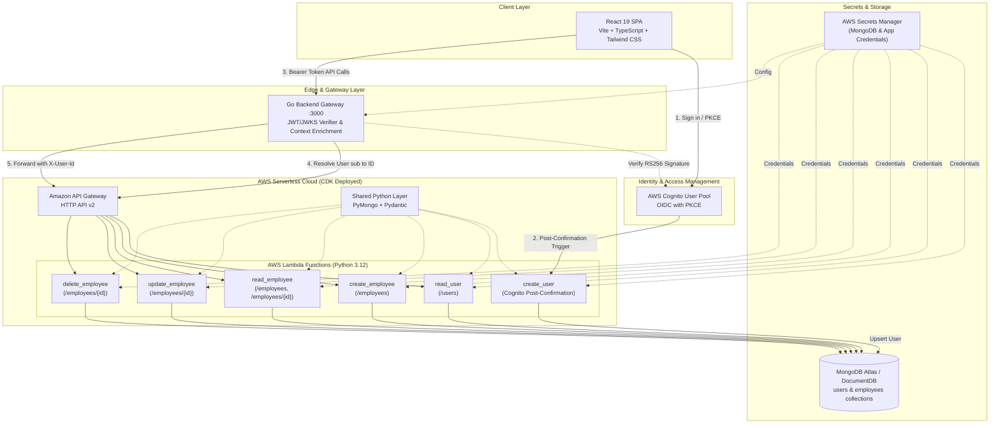

# Employee Management System

A multi-tenant, cloud-native full-stack employee directory application built with **React 19**, a **Go API Gateway**, **AWS Cognito** authentication, and **Python AWS Lambda** serverless microservices backed by **MongoDB**.

---

## Architecture Overview



---

## User Lifecycle & Data Flow

1. **User Sign-Up & Confirmation**:
   - A user signs up and confirms their account via AWS Cognito.
   - Cognito automatically invokes the `create_user` Post Confirmation Lambda trigger.
   - The trigger upserts the user's `cognitoSub`, `email`, and `name` into the `users` collection in MongoDB.

2. **Authentication & Authorization**:
   - The React frontend authenticates via Cognito Authorization Code flow with PKCE (`react-oidc-context`).
   - Outbound requests to the Go backend carry `Authorization: Bearer <access_token>`.
   - The Go gateway verifies token validity against Cognito JWKS key sets (`/.well-known/jwks.json`), queries the user service (`GET /users?sub=...`), and injects the MongoDB user identity into the request context.
   - When access tokens expire, an Axios interceptor triggers silent session renewal (`auth.signinSilent()`).

3. **Multi-Tenant Employee CRUD**:
   - The Go gateway forwards employee CRUD requests to the API Gateway HTTP API, injecting the authenticated tenant ID into the `X-User-Id` header.
   - All employee queries and mutations in MongoDB are scoped to `createdBy: <X-User-Id>`, ensuring strict tenant isolation.

---

## Repository Structure

```
Employee-Management-System/
├── frontend/                  # React 19 SPA (Vite, TypeScript, Tailwind CSS v4)
│   ├── src/
│   │   ├── api/               # Axios API clients for employees and user profile
│   │   ├── components/        # UI components (Navbar, Table, Modals, AuthGuard)
│   │   ├── hooks/             # Custom hooks (Auth Interceptor, Profile, Employees)
│   │   ├── types/             # TypeScript interfaces for models & API responses
│   │   └── authConfig.ts      # Cognito OIDC client configuration
│   └── README.md              # Frontend documentation
│
├── backend/                   # Go API Gateway & JWT Verifier
│   ├── cmd/server/            # Application entrypoint
│   ├── internal/
│   │   ├── config/            # Secrets Manager & environment loader
│   │   ├── employee/          # Employee HTTP handlers & downstream client
│   │   ├── middleware/        # RS256 JWKS verifier, CORS, and slog logger
│   │   ├── router/            # net/http route definitions
│   │   └── user/              # User profile handler & sub-resolver client
│   └── README.md              # Backend documentation
│
├── employee-crud-lambda/      # Serverless Microservices (Python 3.12)
│   ├── app/
│   │   ├── common/            # Shared DB connection, Pydantic schemas & PyMongo repo
│   │   ├── create_user/       # Cognito Post-Confirmation trigger handler
│   │   ├── read_user/         # User lookup by sub/email handler
│   │   ├── create_employee/   # Employee creation handler
│   │   ├── read_employee/     # Employee list/get handler
│   │   ├── update_employee/   # Employee patch handler
│   │   ├── delete_employee/   # Employee delete handler
│   │   └── test_local.py      # Local verification test script
│   └── README.md              # Lambda microservices documentation
│
└── infrastructure/            # AWS CDK v2 Python Stack
    ├── infrastructure/
    │   └── infrastructure_stack.py # CDK stack (Lambdas, Layer, API Gateway, IAM)
    ├── app.py                 # CDK application entry point
    └── README.md              # Infrastructure & deployment documentation
```

---

## Component Documentation

| Component | Description | Guide |
|---|---|---|
| **Frontend** | React 19 SPA, Tailwind CSS v4, OIDC authentication, CRUD UI | [Frontend Guide](./frontend/README.md) |
| **Backend** | Go HTTP REST gateway, Cognito JWKS verifier, tenant proxy | [Backend Guide](./backend/README.md) |
| **Lambda Microservices** | Python 3.12 Lambdas, PyMongo, Pydantic, tenant isolation | [Lambda Guide](./employee-crud-lambda/README.md) |
| **Infrastructure** | AWS CDK v2 (Python) stack, API Gateway HTTP API, Layer bundling | [Infrastructure Guide](./infrastructure/README.md) |

---

## End-to-End Setup Guide

### 1. Prerequisites
- **Node.js 18+** & **npm**
- **Go 1.22+**
- **Python 3.12+**
- **Docker Desktop** (required for AWS CDK Lambda bundling)
- **AWS CLI v2** configured with admin credentials
- **MongoDB Atlas** cluster (or local MongoDB instance)

---

### 2. AWS Cognito Configuration
1. Create a **Cognito User Pool**:
   - Enable **Email** as a sign-in identifier.
   - Configure required user attributes: `email` and `name`.
2. Create an **App Client**:
   - Client Type: **Public client** (Generate client secret: **Disabled**).
   - Allowed OAuth Flows: **Authorization code grant**.
   - Allowed OAuth Scopes: `openid`, `email`, `phone`.
   - Allowed Callback URLs: `http://localhost:5173`.
   - Allowed Sign-out URLs: `http://localhost:5173`.
3. Configure a **Cognito Domain** (e.g., `https://<domain>.auth.<region>.amazoncognito.com`).

---

### 3. Deploy Serverless Infrastructure (AWS CDK)

```bash
cd infrastructure

# Create virtual environment and install dependencies
python3 -m venv .venv
source .venv/bin/activate
pip install -r requirements.txt

# Configure environment variables in infrastructure/.env
cat <<EOF > .env
CDK_DEFAULT_ACCOUNT=$(aws sts get-caller-identity --query Account --output text)
CDK_DEFAULT_REGION=ap-south-1
MONGODB_SECRET_ARN=arn:aws:secretsmanager:ap-south-1:...:secret:...
EOF

# Deploy stack
cdk deploy
```

> **Take note of stack outputs**:
> - `HttpApiUrl` &rarr; Used by the Go backend (`EMS_API_URL`).
> - `CreateUserLambdaArn` &rarr; Attached as Cognito Post-Confirmation Trigger.

Attach the `CreateUserLambdaArn` in the Cognito Console under **User Pool Properties &rarr; Lambda triggers &rarr; Post confirmation**.

---

### 4. Start the Go Backend Gateway

```bash
cd backend

# Create backend/.env file
cat <<EOF > .env
APP_ENV=development
HTTP_ADDR=:3000
AWS_REGION=ap-south-1
COGNITO_USER_POOL_ID=ap-south-1_xxxxxxxxx
COGNITO_CLIENT_ID=xxxxxxxxxxxxxxxxxxxxxxxxxx
EMS_API_URL=https://<api-gateway-id>.execute-api.ap-south-1.amazonaws.com
ALLOWED_ORIGIN=http://localhost:5173
EOF

# Run server
go run cmd/server/main.go
```
The backend gateway starts listening at `http://localhost:3000`.

---

### 5. Start the React Frontend

```bash
cd frontend

# Create frontend/.env file
cat <<EOF > .env
VITE_API_BASE_URL=http://localhost:3000
VITE_COGNITO_AUTHORITY=https://cognito-idp.ap-south-1.amazonaws.com/ap-south-1_xxxxxxxxx
VITE_COGNITO_CLIENT_ID=xxxxxxxxxxxxxxxxxxxxxxxxxx
VITE_COGNITO_REDIRECT_URI=http://localhost:5173
VITE_COGNITO_DOMAIN=https://<your-domain>.auth.ap-south-1.amazoncognito.com
VITE_COGNITO_SCOPE=openid email phone
EOF

# Install dependencies and start Vite dev server
npm install
npm run dev
```
Open `http://localhost:5173` in your browser. Sign in using your Cognito credentials to access the employee management portal.

---

## Environment Variables Matrix

| Variable | Service | Required | Description |
|---|---|---|---|
| `CDK_DEFAULT_ACCOUNT` | Infrastructure | Yes | AWS Account ID |
| `CDK_DEFAULT_REGION` | Infrastructure | Yes | AWS Region |
| `MONGODB_SECRET_ARN` | Infrastructure / Lambda | Yes* | AWS Secrets Manager secret ARN for MongoDB credentials |
| `MONGODB_URI` | Lambda | Yes* | MongoDB connection string (local development fallback) |
| `APP_ENV` | Backend | No | `development` or `production` |
| `HTTP_ADDR` | Backend | No | Gateway listener address (default `:3000`) |
| `AWS_REGION` | Backend | Yes | Region of Cognito User Pool |
| `COGNITO_USER_POOL_ID` | Backend | Yes | Cognito User Pool ID |
| `COGNITO_CLIENT_ID` | Backend | Yes | Cognito App Client ID |
| `EMS_API_URL` | Backend | Yes | URL of deployed API Gateway HTTP API |
| `ALLOWED_ORIGIN` | Backend | No | CORS allowed origin (default `*`) |
| `BACKEND_SECRET_ARN` | Backend | Optional | Secrets Manager ARN containing backend config |
| `VITE_API_BASE_URL` | Frontend | Yes | Backend gateway base URL (`http://localhost:3000`) |
| `VITE_COGNITO_AUTHORITY`| Frontend | Yes | Cognito OIDC authority issuer URL |
| `VITE_COGNITO_CLIENT_ID`| Frontend | Yes | Cognito App Client ID |
| `VITE_COGNITO_REDIRECT_URI`| Frontend | Yes | SPA callback redirect URL (`http://localhost:5173`) |
| `VITE_COGNITO_DOMAIN` | Frontend | Yes | Cognito Hosted UI domain URL |
| `VITE_COGNITO_SCOPE` | Frontend | No | Requested OIDC scopes (`openid email phone`) |

---

## License

This project is licensed under the MIT License.
