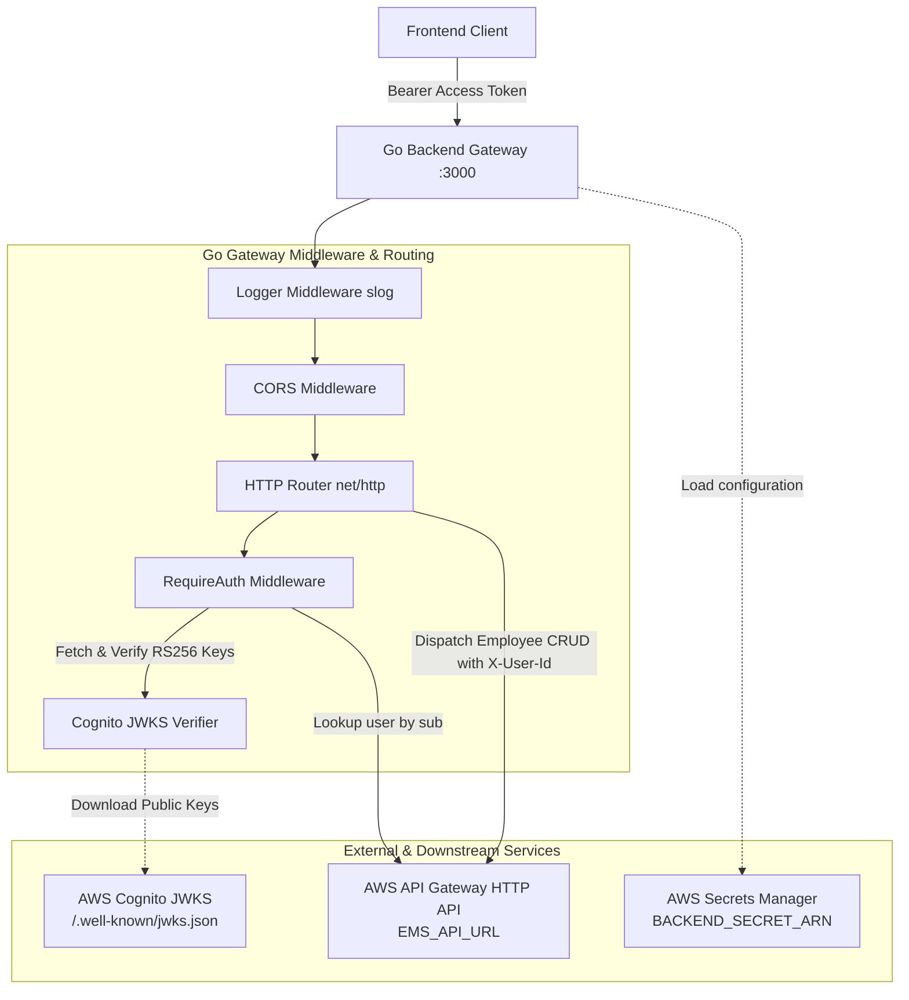

# Backend API (Go Gateway & Verifier)

The Go backend serves as the secure API gateway and identity broker for the Employee Management System. It validates AWS Cognito JWT access tokens using public JWKS key sets, resolves authenticated user identities to MongoDB user documents, and proxies tenant-scoped employee CRUD requests downstream to the serverless Lambda microservices.

---

## Architecture Overview



---

## Key Features

- **JWT Authentication & JWKS Verification**:
  - Automatically fetches and parses RS256 signing keys from AWS Cognito's `.well-known/jwks.json` endpoint.
  - Validates token validity, expiration, issuer (`https://cognito-idp.<region>.amazonaws.com/<userPoolId>`), audience/client ID, and ensures `token_use == "access"`.
- **Tenant Context Resolution**:
  - Resolves the Cognito `sub` claim to the user's MongoDB `_id` via downstream user microservice (`GET /users?sub=...`).
  - Attaches user context to request and propagates `X-User-Id` header to downstream employee endpoints.
- **Payload Validation**:
  - Enforces strict employee ID formatting on `POST /employees` (`^EMP-\d{3}$`, e.g. `EMP-001`).
  - Limits JSON request bodies to 1 MB and rejects unknown fields.
- **Observability & Resilience**:
  - Structured JSON logging using Go's standard library `log/slog`.
  - Configurable HTTP server timeouts (ReadHeader: 5s, Read: 10s, Write: 15s, Idle: 60s).
  - Configurable CORS middleware.

---

## API Endpoints

All protected endpoints require an `Authorization: Bearer <access_token>` header.

| Method | Path | Auth | Description | Downstream Call |
|---|---|---|---|---|
| `GET` | `/healthz` | Public | Service health check | None |
| `GET` | `/profile` | Protected | Returns authenticated user profile | None (Resolved from Context) |
| `GET` | `/employees` | Protected | Lists all employees for tenant | `GET /employees` (`X-User-Id`) |
| `POST` | `/employees` | Protected | Creates new employee | `POST /employees` (`X-User-Id`) |
| `GET` | `/employees/{id}` | Protected | Retrieves single employee | `GET /employees/{id}` (`X-User-Id`) |
| `PATCH` | `/employees/{id}` | Protected | Updates employee fields | `PATCH /employees/{id}` (`X-User-Id`) |
| `DELETE` | `/employees/{id}` | Protected | Deletes an employee | `DELETE /employees/{id}` (`X-User-Id`) |

---

## Response Envelope Format

All responses follow a consistent JSON envelope structure:

### Success Response (`200 OK` / `201 Created`)
```json
{
  "success": true,
  "message": "employees retrieved successfully",
  "data": [
    {
      "_id": "67890abcdef...",
      "empID": "EMP-001",
      "createdBy": "64d0a1b2c3d4e5f6a7b8c9d0",
      "name": "Alice Smith",
      "email": "alice@example.com",
      "department": "Engineering",
      "salary": 95000.0
    }
  ]
}
```

### Error Response (`400`, `401`, `404`, `500`)
```json
{
  "success": false,
  "message": "empID must be in the format EMP-123 (EMP- followed by exactly 3 digits)"
}
```

> **Token Expiry Response**: When an expired token is presented, the server responds with HTTP `401 Unauthorized` and `{"success": false, "message": "token_expired"}`. The frontend interceptor detects this specific message to initiate a silent token refresh.

---

## Prerequisites

- **Go 1.22+** (configured with Go 1.26 toolchain in `go.mod`)
- AWS Cognito User Pool with an App Client configured
- Deployed AWS API Gateway HTTP API endpoint ([Infrastructure](../infrastructure/README.md))

---

## Configuration & Environment Variables

Configuration can be supplied via a local `.env` file or dynamically loaded from **AWS Secrets Manager** using `BACKEND_SECRET_ARN`.

### Environment Variables Reference

| Variable | Required | Default | Description |
|---|---|---|---|
| `APP_ENV` | No | `development` | Environment name (`development`, `production`) |
| `HTTP_ADDR` | No | `:3000` | Address and port for the HTTP listener |
| `AWS_REGION` | No | `ap-south-1` | AWS Region for Cognito and Secrets Manager |
| `COGNITO_USER_POOL_ID` | Yes | - | AWS Cognito User Pool ID |
| `COGNITO_CLIENT_ID` | Yes | - | AWS Cognito App Client ID |
| `EMS_API_URL` | Yes | - | Downstream API Gateway HTTP API URL |
| `ALLOWED_ORIGIN` | No | `*` | Allowed CORS origin (e.g. `http://localhost:5173`) |
| `BACKEND_SECRET_ARN` | Optional | - | AWS Secrets Manager secret ARN containing configuration |

### Example `.env` File
```env
APP_ENV=development
HTTP_ADDR=:3000
AWS_REGION=ap-south-1
COGNITO_USER_POOL_ID=ap-south-1_xxxxxxxxx
COGNITO_CLIENT_ID=xxxxxxxxxxxxxxxxxxxxxxxxxx
EMS_API_URL=https://<api-gateway-id>.execute-api.ap-south-1.amazonaws.com
ALLOWED_ORIGIN=http://localhost:5173
```

### AWS Secrets Manager JSON Structure (Optional)
If `BACKEND_SECRET_ARN` is provided, the application parses the secret string for keys:
```json
{
  "COGNITO_USER_POOL_ID": "ap-south-1_xxxxxxxxx",
  "COGNITO_CLIENT_ID": "xxxxxxxxxxxxxxxxxxxxxxxxxx",
  "EMS_API_URL": "https://<api-gateway-id>.execute-api.ap-south-1.amazonaws.com",
  "ALLOWED_ORIGIN": "http://localhost:5173",
  "HTTP_ADDR": ":3000"
}
```

---

## Running Locally

```bash
cd backend

# 1. Download and verify Go dependencies
go mod download

# 2. Run the application
go run cmd/server/main.go

# 3. Build a standalone binary
go build -o bin/server cmd/server/main.go
./bin/server
```

---

## Health Check Verification

```bash
curl -i http://localhost:3000/healthz
```

Expected output:
```http
HTTP/1.1 200 OK
Content-Type: application/json
Date: ...

{"success":true,"message":"ok","data":null}
```
