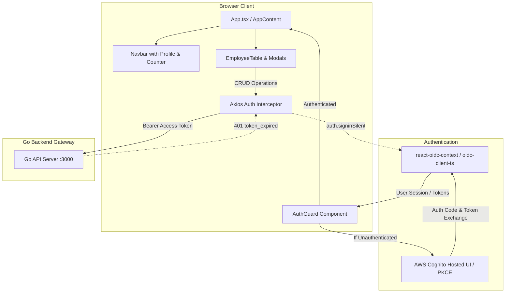

# Frontend UI (React + TypeScript + Vite + Tailwind CSS)

Single-Page Application (SPA) for the Employee Management System, built with **React 19**, **TypeScript**, **Vite 8**, **Tailwind CSS v4**, and **`react-oidc-context`**.

The frontend provides an intuitive, tenant-isolated employee directory interface featuring live search, full CRUD modals, AWS Cognito authentication with PKCE, and transparent silent token renewal.

---

## Architecture Overview



---

## Features

- **AWS Cognito Authentication with PKCE**:
  - Leverages `react-oidc-context` and `oidc-client-ts` for standards-compliant Authorization Code flow with PKCE.
  - Securely stores session tokens in browser `localStorage`.
  - Cleans OAuth callback parameters from the URL after successful sign-in.
- **Silent Token Renewal**:
  - Axios response interceptor (`useAuthInterceptor`) detects `401 Unauthorized` responses containing `token_expired`.
  - Triggers transparent token refresh in the background via `auth.signinSilent()` and replays failed API requests without interrupting the user.
- **Tenant Isolation**:
  - Users only see and manage employee records they have created.
- **Interactive Directory Management**:
  - **Live Search**: Client-side filtering by name, email, or department with instant clear button.
  - **Modals**: Add Employee, Edit Employee, View Employee Details, and Delete Confirmation.
  - **Asynchronous Feedback**: Real-time toast notifications powered by `react-hot-toast` for all mutation operations.
- **User Profile & Status**:
  - Top navigation bar displaying authenticated user name, email, and live employee counter.
  - Cognito-compliant hosted UI sign-out with session revocation.

---

## Project Structure

```
frontend/src/
├── api/
│   ├── employees.ts        # Axios client instance and employee CRUD API calls
│   └── user.ts             # User profile retrieval API call
├── components/
│   ├── AuthGuard.tsx       # Authentication state wrapper and login splash screen
│   ├── DeleteConfirm.tsx   # Modal confirmation dialog for employee deletion
│   ├── EmployeeForm.tsx    # Add / Edit employee modal with validation
│   ├── EmployeeTable.tsx   # Responsive table displaying employee directory
│   ├── EmployeeView.tsx    # Modal displaying detailed employee information
│   └── Navbar.tsx          # Top header with profile info, count, and actions
├── hooks/
│   ├── useAuthInterceptor.ts # Axios request/response interceptor for bearer tokens & silent renewal
│   ├── useEmployees.ts     # Custom hook for employee state, search, and CRUD mutations
│   └── useProfile.ts       # Custom hook fetching authenticated user profile
├── types/
│   ├── auth.ts             # User profile and auth state type definitions
│   └── employee.ts         # Employee model, form payload, and API response envelope types
├── authConfig.ts           # OIDC client configuration for AWS Cognito
├── App.tsx                 # Root application component and modal state manager
├── index.css               # Tailwind CSS v4 entry point
└── main.tsx                # Application bootstrap and AuthProvider wrapper
```

---

## Prerequisites

- **Node.js (v18+)**
- **npm** (or yarn / pnpm)
- Running [Go Backend API](../backend/README.md) on port `:3000`
- Configured AWS Cognito User Pool with App Client (client secret disabled for SPA)

---

## Environment Variables

Create a `.env` file in the `frontend/` directory:

```env
# Backend API Base URL
VITE_API_BASE_URL=http://localhost:3000

# AWS Cognito Configuration
VITE_COGNITO_AUTHORITY=https://cognito-idp.ap-south-1.amazonaws.com/ap-south-1_xxxxxxxxx
VITE_COGNITO_CLIENT_ID=xxxxxxxxxxxxxxxxxxxxxxxxxx
VITE_COGNITO_REDIRECT_URI=http://localhost:5173
VITE_COGNITO_DOMAIN=https://<your-auth-domain>.auth.ap-south-1.amazoncognito.com
VITE_COGNITO_SCOPE=openid email phone
```

| Variable | Required | Description |
|---|---|---|
| `VITE_API_BASE_URL` | Yes | URL of the Go backend gateway (e.g., `http://localhost:3000`) |
| `VITE_COGNITO_AUTHORITY` | Yes | Cognito OIDC issuer endpoint (`https://cognito-idp.<region>.amazonaws.com/<user-pool-id>`) |
| `VITE_COGNITO_CLIENT_ID` | Yes | Cognito App Client ID (public client without client secret) |
| `VITE_COGNITO_REDIRECT_URI` | Yes | Allowed Callback / Sign-out URL (e.g., `http://localhost:5173`) |
| `VITE_COGNITO_DOMAIN` | Yes | Cognito Hosted UI domain URL for sign-out redirection |
| `VITE_COGNITO_SCOPE` | No | OIDC scopes to request (defaults to `openid email phone`) |

> **Cognito App Client Setup**:
> Ensure that the Cognito App Client has **Authorization code grant** enabled, with `VITE_COGNITO_REDIRECT_URI` added to both **Allowed callback URLs** and **Allowed sign-out URLs**.

---

## Getting Started

### 1. Install Dependencies
```bash
cd frontend
npm install
```

### 2. Start Local Development Server
```bash
npm run dev
```
The application will be accessible at `http://localhost:5173`.

### 3. Build for Production
```bash
npm run build
```
Production assets will be output to `frontend/dist/`.

### 4. Preview Production Build
```bash
npm run preview
```

### 5. Lint Codebase
```bash
npm run lint
```
